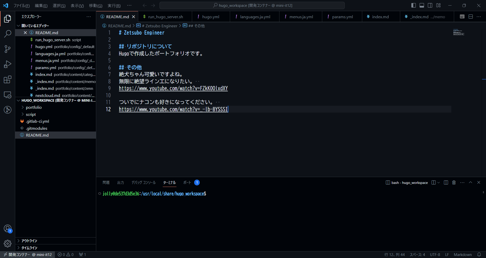

# Hugo Dev Container

## リポジトリについて
Hugoと開発コンテナを使ってポートフォリオを作成するための環境です。

## 前提条件
* Docker(Community Edition)とDocker Composeがインストールされていること
    * [Supported platforms](https://docs.docker.com/engine/install/#server)  
    * [Install Docker Engine on Debian](https://docs.docker.com/engine/install/debian/#install-using-the-convenience-script)
    * [Install Docker Engine on Ubuntu](https://docs.docker.com/engine/install/ubuntu/#install-using-the-convenience-script)
* ログインユーザーがdockerグループに追加されていること
    * [Manage Docker as a non-root user](https://docs.docker.com/engine/install/linux-postinstall/#manage-docker-as-a-non-root-user)
* VSCodeと拡張機能がインストールされていること
    * [Remote Development](https://marketplace.visualstudio.com/items?itemName=ms-vscode-remote.vscode-remote-extensionpack)

## 環境構築
1. リポジトリをクローンする
<pre>
$ git clone --recursive http://rm.zetsubo.net/ze/hugo-dev-container.git
</pre>
2. build_container_image.shを実行する
<pre>
$ cd hugo-dev-container
$ bash ./script/build_container_image.sh
</pre>
3. 開発コンテナを起動する  
    1. F1→"Dev Containers: Open Folder in Container..."→hugoを選択してOK
    
    開発コンテナが起動できたら成功
    2. 開発コンテナでターミナルを開き、run_hugo_server.shを実行
    
    
    自動的に開発コンテナの1313番ポートがフォワードされる
    3. ブラウザで[http://127.0.0.1:1313](http://127.0.0.1:1313)にアクセス
    
    ポートフォリオが表示されたら成功

## 備考
hugo/volume/usr/local/share/hugo_workspace配下に他のHugoプロジェクトをcloneして開発コンテナを起動できます。  
その場合はhugo/.envのHUGO_PROJECT_NAMEを適宜変更してください。

## 参考情報
* https://gohugo.io/
* https://code.visualstudio.com/docs/devcontainers/containers